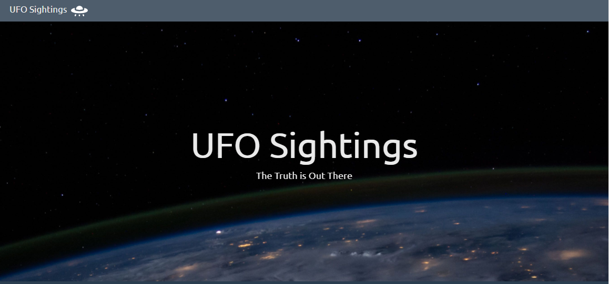
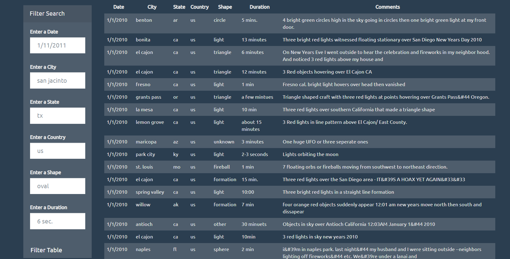

# UFO Sightings: Data Exploration Site with Filters


## Overview
This project creates a styled website with an interactive table based on a dataset of reported UFO sightings. Uses javascript (and d3), html, and css.

## Explore the project here  
https://millerbrook.github.io/UFO_Sightings_Data_Exploration_Site_With_Filters/  

## Data
Stored as a javascript array: [UFO Sightings Data](static/js/data.js).

## Steps

### Step 1
Create an html page with ids and classes organized to visualize the data and listen for filtering events.



### Step 2
Build a table into the html file using D3:
```
function buildHTMLTable(incomingData) {
  //remove leftover rows
  var oldRows = d3.select("tbody").selectAll("tr");
  oldRows.remove();
  //Print table
  var printTable = d3.select("tbody");
  incomingData.forEach(function (tableObject) {
    //Make a row for each object in table
    var row = printTable.append("tr");
    //Print values within each object
    Object.entries(tableObject).forEach(([key, value]) => {
      var cell = row.append("td");
      console.log(value);
      cell.text(value);
    });
  });
}
```
### Step 3
Build input filters for users to search for certain records. 



Use d3 to process events by filtering the data and rebuilding the table.

## Contact Information

Brook Miller

[Email](millerbrook@gmail.com)

[LinkedIn](www.linkedin.com/in/brook-miller-data)
